# IT Helpdesk Auto-Responder Architecture

## System Architecture

```mermaid
graph TB
    User["👤 User"] --> FE["Frontend<br/>(Static HTML/JS or Streamlit)"]
    FE --> API["FastAPI<br/>/diagnose Endpoint"]
    
    subgraph Backend
        API --> LLM["LLM Adapter<br/>(Mock/OpenAI/Bedrock)"]
        API --> DE["Diagnostics Executor<br/>(Safe Commands)"]
        API --> DB["Database<br/>(SQLite/JSON)"]
        
        LLM --> DE
        DE --> LLM
        API --> DB
    end
    
    subgraph "Optional Cloud Services"
        style Cloud fill:#f9f,stroke:#333,stroke-width:2px
        LLM -.-> BE["AWS Bedrock"]
        BE -.-> LLM
        DE -.-> LA["AWS Lambda"]
        LA -.-> DE
    end
```

## Component Description

### Frontend Layer
- Static HTML/JS interface for basic usage
- Optional Streamlit UI for richer interaction
- Makes POST requests to `/diagnose` endpoint
- Displays results in user-friendly format

### FastAPI Backend
- Handles incoming diagnosis requests
- Coordinates between LLM and Diagnostics
- Manages ticket persistence
- Ensures safe command execution

### LLM Adapter
- Mock implementation for testing/demo
- Optional OpenAI integration
- Prepared for AWS Bedrock integration
- Structured outputs with command suggestions

### Diagnostics Executor
- Maintains whitelist of safe commands
- Validates and runs system diagnostics
- Provides simulation mode for demos
- Cross-platform command handling

### Storage Layer
- Primary: SQLite database
- Fallback: JSON file storage
- Tracks tickets and diagnostic results
- Supports analysis and auditing

### Cloud Integration (Optional)
- AWS Bedrock for production LLM
- Lambda for remote diagnostics
- No cloud credentials needed for local use